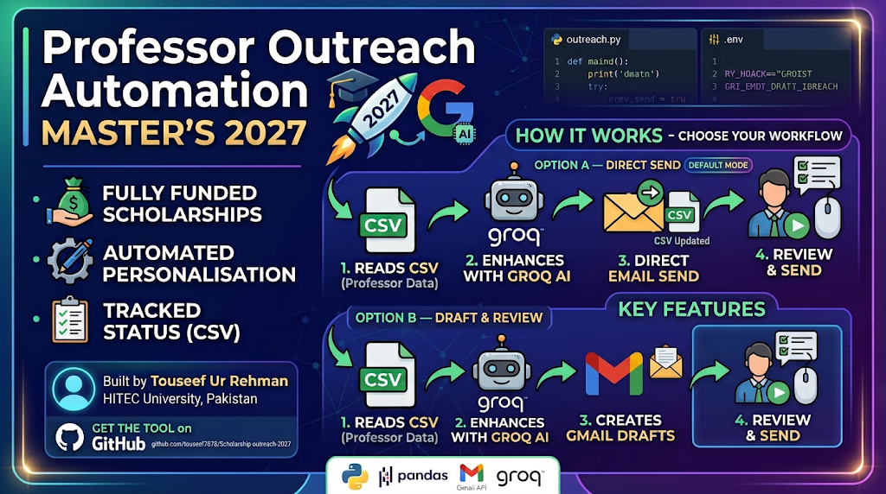

# Professor Outreach Automation — Master's 2027



A local Python tool that automates personalised cold-email outreach to university professors for fully funded Master's scholarship applications (2027 intake).

Built by **Touseef Ur Rehman** — BS Computer Science, HITEC University, Pakistan.

---

## Why This Was Built

Cold-emailing professors is the most effective way to secure a supervisor acceptance letter, which is required for government scholarships and most university-level scholarship routes. Doing it manually across 100+ professors — each needing a personalised email, your CV attached, and a tracked status — is slow and error-prone.

This tool solves that by:

- Storing all professor data (research areas, emails, fit scores, personalisation notes) in a single CSV — can build this from Claude or ChatGPT fully
- Using **Groq AI** (free tier) to write a unique opening hook for each professor based on their research
- **Sending emails directly** via the Gmail API — fast, automated, no manual steps required
- Alternatively, **creating Gmail drafts** if you prefer to review every email before it goes out
- Tracking draft IDs, sent status, follow-up dates, and errors in the same CSV, so nothing gets duplicated or lost

---

## What It Does

**Option A — Direct Send (recommended):**
```
professors.csv  ──►  AI Hook Generation  ──►  Full Email Body  ──►  Send Directly  ──►  CSV Updated
```

**Option B — Draft & Review:**
```
professors.csv  ──►  AI Hook Generation  ──►  Full Email Body  ──►  Gmail Draft  ──►  You Review  ──►  Send
```

1. Reads your professor database (CSV)
2. Generates a personalised 2–3 sentence opening for each professor using Groq AI
3. Assembles the full email: AI hook + your fixed intro + FYP paragraph + scholarship ask + signature
4. **Sends the email directly** — or creates a Gmail draft if you prefer to review first
5. Updates the CSV with sent status (or draft ID) after every action
6. Skips professors already drafted, sent, or replied to — no duplicates

---

## Project Structure

```
.
├── outreach.py              # Main script — all commands live here
├── config.py                # Paths, toggle flags, batch size
├── gmail_service.py         # Gmail API: OAuth, draft creation, send (locked)
├── requirements.txt         # Python dependencies
├── setup_windows.bat        # One-click setup on Windows
├── run_preview.bat          # Preview emails without Gmail access
├── create_5_drafts.bat      # Create first 5 drafts
├── .env                     # Your Groq API key (never commit this)
├── .gitignore               # Protects credentials, tokens, venv
│
├── data/
│   └── professors.csv       # Your professor database
│
├── attachments/
│   └── Touseef_Ur_Rehman_Academic_CV.pdf   # Attached to every email
│
└── credentials/
    ├── credentials.json     # Google OAuth client (never commit)
    └── token.json           # Auto-generated after first login (never commit)
```

---

## Quick Start (Your Machine)

### 1. Prerequisites

- Python 3.10 or later — https://python.org
- A Gmail account
- A Google Cloud project with Gmail API enabled and Desktop OAuth credentials downloaded
- A free Groq API key — https://console.groq.com

### 2. Clone or download the project

```powershell
cd path\to\scholarship-outreach-2027
```

### 3. Set up the virtual environment

```powershell
python -m venv .venv
.venv\Scripts\python.exe -m pip install --upgrade pip
.venv\Scripts\python.exe -m pip install -r requirements.txt
```

Or double-click **`setup_windows.bat`**.

### 4. Add your credentials

Place your Google OAuth JSON file at:
```
credentials/credentials.json
```

Create a `.env` file in the project root:
```
GROQ_API_KEY=your_groq_api_key_here
```

### 5. Check everything is working

```powershell
.venv\Scripts\python.exe outreach.py stats
```

---

## Daily Workflow

There are two ways to use this tool. Pick the one that suits you.

---

### 🚀 Option A — Direct Send (faster)

Use this if you have already previewed and are confident in your emails.

#### Step 1 — Preview emails (no Gmail, no AI)

See the current email body for the next 5 eligible professors:

```powershell
.venv\Scripts\python.exe outreach.py preview --count 5
```

#### Step 2 — Enhance with AI (optional but recommended)

Generate a personalised opening hook for each professor using Groq AI.
This only rewrites the first 2–3 sentences. Everything else stays unchanged.

Preview without saving:
```powershell
.venv\Scripts\python.exe outreach.py enhance --count 10 --preview
```

If you are happy, save to CSV:
```powershell
.venv\Scripts\python.exe outreach.py enhance --count 10
```

#### Step 3 — Send directly

Enable sending in `config.py`:
```python
ALLOW_SEND = True
```

Then send (always start small):
```powershell
.venv\Scripts\python.exe outreach.py send --count 1
```

Check the sent message in Gmail before increasing the count. The CSV is updated automatically.

#### Step 4 — Track

```powershell
.venv\Scripts\python.exe outreach.py stats
```

---

### 📋 Option B — Draft & Review (safer for beginners)

Use this if you want to read every email in Gmail before anything is sent.

#### Step 1 — Preview emails (no Gmail, no AI)

```powershell
.venv\Scripts\python.exe outreach.py preview --count 5
```

#### Step 2 — Enhance with AI (optional but recommended)

```powershell
.venv\Scripts\python.exe outreach.py enhance --count 10
```

#### Step 3 — Create Gmail drafts

On first run, a browser opens for Google OAuth. Sign in once — the token is saved for future runs.

```powershell
.venv\Scripts\python.exe outreach.py draft --count 10
```

Each draft contains:
- Professor's email address
- Personalised subject line
- Full email body (with AI hook if enhanced)
- Your CV PDF attached

#### Step 4 — Review in Gmail

Open Gmail → Drafts. Read every email. Check the name, university, subject, and attachment are correct. Edit anything you want to change.

#### Step 5 — Send from Gmail

When you are satisfied, click **Send** inside Gmail directly.

#### Step 6 — Track and follow up

```powershell
.venv\Scripts\python.exe outreach.py stats
```

Professors marked `Draft created`, `Sent`, or `Replied` are automatically skipped in all future runs.

---

## All Commands

| Command | What it does |
|---------|-------------|
| `outreach.py stats` | Show total records, valid emails, status breakdown |
| `outreach.py preview --count N` | Print next N emails to terminal (no Gmail, no AI) |
| `outreach.py enhance --count N` | Save AI-enhanced opening hooks to CSV |
| `outreach.py enhance --count N --preview` | Preview AI hooks without saving |
| `outreach.py send --count N` | **Send N emails directly** (requires `ALLOW_SEND=True` in config.py) |
| `outreach.py draft --count N` | Create N Gmail drafts with CV attached (for manual review before sending) |

Default batch size is **5** (set in `config.py`).

---

## Sending Lock

Direct sending is disabled by default as a safety measure:

```python
# config.py
ALLOW_SEND = False
```

The `send` command raises an error unless you manually set this to `True`. This prevents accidental bulk sends.

**Recommended approach before enabling:**
1. Run `preview` to check your email body
2. Run `enhance` and review the AI hooks
3. Create 1–2 drafts with `draft` and inspect them in Gmail
4. Once satisfied, set `ALLOW_SEND = True` and start with `--count 1`

> If you prefer to skip drafts entirely and send directly, that is fully supported — just enable `ALLOW_SEND` and use the `send` command. The draft workflow is there for those who want an extra review step.

---

## How to Adapt This for Your Own Outreach

You can use this tool for any scholarship or job application outreach. Here is what to change:

### 1. Replace the professor CSV

Edit `data/professors.csv`. Required columns:

| Column | Description |
|--------|-------------|
| `Professor` | Full name |
| `University` | Institution name |
| `Public_Email` | Recipient email address |
| `Research_Areas` | Comma-separated research topics |
| `Personalized_Email_Subject` | Subject line for this professor |
| `FYP_Research_Connection` | How your project connects to their research |
| `Personalized_Ask` | Closing ask sentence (e.g. supervision request) |
| `Generated_Email_Body` | Full pre-written email body |
| `Email_Status` | Leave blank for new professors |

Optional columns used for AI enhancement:
- `Fit_to_Touseef` / `Personalization_Angle` — notes fed into the AI prompt

### 2. Replace the CV

Put your CV at:
```
attachments/YourName_CV.pdf
```

Update the path in `config.py`:
```python
CV_FILE = BASE_DIR / "attachments" / "YourName_CV.pdf"
```

### 3. Update the applicant profile in `outreach.py`

Edit the `APPLICANT_PROFILE` constant near the top of `outreach.py` with your own name, degree, CGPA, research interests, and project description. This is injected into every AI prompt.

### 4. Update the fixed email template in `_build_email_body()`

Change the intro paragraph (name, university, CGPA, interests) and signature to match your own details.

### 5. Set up your own Google OAuth credentials

Follow the Google Cloud steps in the **Prerequisites** section. Download your own `credentials.json` and place it in `credentials/`.

### 6. Get a free Groq API key

Register at https://console.groq.com, create an API key, and add it to `.env`:
```
GROQ_API_KEY=your_key_here
```

---

## Security

| File | Risk | Protection |
|------|------|------------|
| `credentials/credentials.json` | Google OAuth client secret | Listed in `.gitignore` — never commit |
| `credentials/token.json` | Your Gmail access token | Listed in `.gitignore` — never commit |
| `.env` | Groq API key | Listed in `.gitignore` — never commit |
| `data/professors.csv` | Personal contact data | Not gitignored — do not push to public repos |

Never share `credentials.json` or `token.json`. If either is compromised, revoke the OAuth client in Google Cloud Console immediately.

---

## CSV Status Reference

| Status | Meaning |
|--------|---------|
| *(blank)* | Not yet contacted |
| `Draft created` | Gmail draft exists — not sent |
| `Sent` | Email sent via the tool |
| `Replied` | Professor replied (set manually) |
| `Error` | Something went wrong — check `Last_Error` column |

---

## Troubleshooting

**`ModuleNotFoundError`** — Run `pip install -r requirements.txt` inside the venv.

**`Missing credentials.json`** — Download Desktop OAuth credentials from Google Cloud Console and place at `credentials/credentials.json`.

**`GROQ_API_KEY not found`** — Create a `.env` file in the project root with `GROQ_API_KEY=your_key`.

**OAuth browser does not open** — Run the command in a normal PowerShell window (not inside VS Code's terminal). The browser must be accessible.

**Hook truncated / retrying** — The AI returned an incomplete sentence. The tool retries automatically up to 3 times. If it keeps failing, run `enhance` again.

**Duplicate drafts in Gmail** — If you deleted drafts from Gmail but the CSV still shows `Draft created`, run:
```powershell
.venv\Scripts\python.exe -c "
import pandas as pd
df = pd.read_csv('data/professors.csv', dtype=str).fillna('')
mask = df['Email_Status'].str.strip().str.lower() == 'draft created'
df.loc[mask, ['Email_Status', 'Gmail_Draft_ID']] = ''
df.to_csv('data/professors.csv', index=False, encoding='utf-8-sig')
print(f'Reset {mask.sum()} rows.')
"
```

---

## Tech Stack

| Component | Library / Service |
|-----------|------------------|
| Data management | pandas |
| Gmail API | google-api-python-client, google-auth-oauthlib, google-auth-httplib2 |
| AI hook generation | Groq API (qwen/qwen3.8-27b) |
| Environment variables | python-dotenv |
| Email encoding | Python standard library (email, base64, mimetypes) |

---

## Licence

Personal use only. Not for redistribution without modification of personal details.
